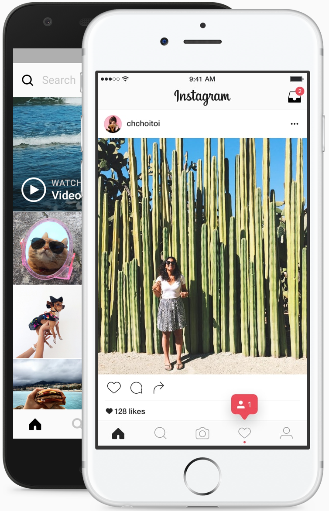
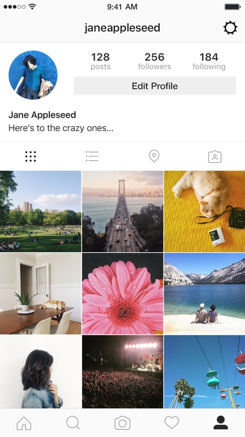

# Projet Controle Copie Instagram

## Page de Connexion :

### Pour le code html minimal

```
<!DOCTYPE html>
<html lang="en">
<head>
    <meta charset="UTF-8">
    <meta http-equiv="X-UA-Compatible" content="IE=edge">
    <meta name="viewport" content="width=device-width, initial-scale=1.0">
    <title>Instagram</title>
    <link rel="stylesheet" href="./css/reset.css">
    <link rel="stylesheet" href="./css/style.css">
    <link rel="stylesheet" href="https://cdnjs.cloudflare.com/ajax/libs/font-awesome/5.15.3/css/all.min.css" integrity="sha512-iBBXm8fW90+nuLcSKlbmrPcLa0OT92xO1BIsZ+ywDWZCvqsWgccV3gFoRBv0z+8dLJgyAHIhR35VZc2oM/gI1w==" crossorigin="anonymous" />
    <link rel="stylesheet" type="text/css" href="https://maxcdn.bootstrapcdn.com/font-awesome/4.7.0/css/font-awesome.min.css">
    <link rel="apple-touch-icon" sizes="180x180" href="ico/apple-touch-icon.png">
    <link rel="icon" type="image/png" sizes="32x32" href="ico/favicon-32x32.png">
    <link rel="icon" type="image/png" sizes="16x16" href="ico/favicon-16x16.png">
    <link rel="manifest" href="ico/site.webmanifest">

</head>
<body>

    <header>
        <h1>RÉALISATION D'UNE COPIE DE LA PAGE DE CONNEXION DU SITE <a href="https://www.instagram.com/">INSTAGRAM</a></h1>
    </header>

    <main>
        <div role="img" id="pirate" aria-labelledby="image-principal">
            
            <ul>
                <li></li>
                <li></li>
                <li></li>
                <li></li>
                <li></li>
            </ul>
        </div><!--

     --><div role="form" id="forma" aria-labelledby="Formulaire">
            <fieldset id="Formulaire">

            
                
                <form id="myForm"  method="get" action="acceuil.html">
                    <span id="mail_manquant"></span>
                    <!--Email-->
                    <input type="email" id="username" name="username" placeholder="Num. téléphone, nom d'utilisateur ou e-mail" required>
                    <!--Password-->
                    <input type="password" id="password-field" name="password" placeholder="Mot de passe" required>
                    <!--Submit-->
                    <button id="but" type="submit"  class="signinbtn">Connexion</button>
                </form>

                <ul class="ou">
                    <li><hr></li><!--
                 --><li class="card">OU</li><!--
                 --><li><hr></li>
                </ul>

                <ul class="facebook">
                    <li><p><a href="https://www.facebook.com/login.php?skip_api_login=1&api_key=124024574287414&kid_directed_site=0&app_id=124024574287414&signed_next=1&next=https%3A%2F%2Fwww.facebook.com%2Fdialog%2Foauth%3Fclient_id%3D124024574287414%26redirect_uri%3Dhttps%253A%252F%252Fwww.instagram.com%252Faccounts%252Fsignup%252F%26state%3D%257B%2522fbLoginKey%2522%253A%252214vvp4ixiwzacuxq2rqck8i5s1cyoq9qairxe49rqg2o1qzp6vc%2522%252C%2522fbLoginReturnURL%2522%253A%2522%252Ffxcal%252Fdisclosure%252F%253Fnext%253D%25252F%2522%257D%26scope%3Demail%26response_type%3Dcode%252Cgranted_scopes%26locale%3Dfr_FR%26ret%3Dlogin%26fbapp_pres%3D0%26logger_id%3D8192b253-d0bd-4425-beec-188ef98b8351%26tp%3Dunspecified&cancel_url=https%3A%2F%2Fwww.instagram.com%2Faccounts%2Fsignup%2F%3Ferror%3Daccess_denied%26error_code%3D200%26error_description%3DPermissions%2Berror%26error_reason%3Duser_denied%26state%3D%257B%2522fbLoginKey%2522%253A%252214vvp4ixiwzacuxq2rqck8i5s1cyoq9qairxe49rqg2o1qzp6vc%2522%252C%2522fbLoginReturnURL%2522%253A%2522%252Ffxcal%252Fdisclosure%252F%253Fnext%253D%25252F%2522%257D%23_%3D_&display=page&locale=fr_FR&pl_dbl=0"><i class="fa fa-facebook-official" aria-hidden="true"></i> &nbsp;&nbsp;<strong>Se connecter avec Facebook</strong></a></p></li>
                    <li><p><a href="https://www.instagram.com/accounts/password/reset/?hl=fr">Mot de passe oublié ?</a></p></li>
                </ul>
            </fieldset>


            <section class="tel1">
                <h2>Vous n’avez pas de compte &nbsp;? <a href="https://www.instagram.com/accounts/emailsignup/">&nbsp;<strong>Inscrivez-vous</strong></a></h2>
            </section>

            <section class="tel">
                <h3>Téléchargez l’application.</h3>
                <ul class="darty">
                    <li><a href="https://apps.apple.com/app/instagram/id389801252?vt=lo"></a></li><!--
                 --><li><a href="https://play.google.com/store/apps/details?id=com.instagram.android&referrer=utm_source%3Dinstagramweb&utm_campaign=loginPage&ig_mid=023D7B45-BC58-4340-BBBB-B0296D3829DB&utm_content=lo&utm_medium=badge"></a></li>
                </ul>
            </section>
        </div>

        

    </main>
    <aside>
        <ul class="aside-ul-1">
            <li>Meta</li><!--
         --><li>Blog</li><!--
         --><li>Emplois</li><!--
         --><li>Aide</li><!--
         --><li>API</li><!--
         --><li>Confidentialité</li><!--
         --><li>Conditions</li><!--
         --><li>Comptes</li><!--
         --><li>principaux</li><!--
         --><li>Hashtags</li><!--
         --><li>Lieux</li><!--
         --><li>Instagram</li><!--
         --><li>Lite</li>
        </ul>

        <ul class="aside-ul-2">
            <li>Beauté</li><!--
         --><li>Danse</li><!--
         --><li>Fitness</li><!--
         --><li>Alimentation</li><!--
         --><li>et boissons</li><!--
         --><li>Maison</li><!--
         --><li>et jardin</li><!--
         --><li>Musique</li><!--
         --><li>Arts visuels</li>
        </ul>
    </aside>

    <footer>
        <p>
            <select aria-label="Changer la langue d’affichage" class="hztqj">
                <option value="af">Afrikaans</option>
                <option value="cs">Čeština</option>
                <option value="da">Dansk</option>
                <option value="de">Deutsch</option>
                <option value="el">Ελληνικά</option>
                <option value="en">English</option>
                <option value="en-gb">English (UK)</option>
                <option value="es">Español (España)</option>
                <option value="es-la">Español</option>
                <option value="fi">Suomi</option>
                <option value="fr">Français</option>
                <option value="id">Bahasa Indonesia</option>
                <option value="it">Italiano</option>
                <option value="ja">日本語</option>
                <option value="ko">한국어</option>
                <option value="ms">Bahasa Melayu</option>
                <option value="nb">Norsk</option>
                <option value="nl">Nederlands</option>
                <option value="pl">Polski</option>
                <option value="pt-br">Português (Brasil)</option>
                <option value="pt">Português (Portugal)</option>
                <option value="ru">Русский</option>
                <option value="sv">Svenska</option>
                <option value="th">ภาษาไทย</option>
                <option value="tl">Filipino</option>
                <option value="tr">Türkçe</option>
                <option value="zh-cn">中文(简体)</option>
                <option value="zh-tw">中文(台灣)</option>
                <option value="bn">বাংলা</option>
                <option value="gu">ગુજરાતી</option>
                <option value="hi">हिन्दी</option>
                <option value="hr">Hrvatski</option>
                <option value="hu">Magyar</option>
                <option value="kn">ಕನ್ನಡ</option>
                <option value="ml">മലയാളം</option>
                <option value="mr">मराठी</option>
                <option value="ne">नेपाली</option>
                <option value="pa">ਪੰਜਾਬੀ</option>
                <option value="si">සිංහල</option>
                <option value="sk">Slovenčina</option>
                <option value="ta">தமிழ்</option>
                <option value="te">తెలుగు</option>
                <option value="vi">Tiếng Việt</option>
                <option value="zh-hk">中文(香港)</option>
                <option value="bg">Български</option>
                <option value="fr-ca">Français (Canada)</option>
                <option value="ro">Română</option>
                <option value="sr">Српски</option>
                <option value="uk">Українська</option>
            </select>
        
            &copy; - lahmar Tabai 2021
        </p>
    </footer>
    <script src="./js/app.js"></script>
</body>
</html>

```

### Pour le code CSS minimal

```
@media screen and (max-width: 800px) {
    header{
        line-height: 2.5rem;
        margin-bottom: 2rem;
    }
    
    header > h1{
        line-height: 5rem;
        text-align: center;
        text-transform: uppercase;
        color: #a19f9f;
        font-size: 100%;
        margin-top: 2rem;
    }
    
    header h1 a{
        color: #222;
    }
    
    main img {
        display: block;
        width: 100%;
    }
    
    main, aside, footer{
        max-width: 37rem;
        background-color: #fafafa;
        padding: 1.0rem;
        margin: 2rem auto 1rem;
    }
    
    main fieldset {
        border: solid rgb(224, 222, 222) .1rem;
    }
    
    #logo-svg {
        max-width: 17.5rem;
        height: 5.1rem;
        margin: 2rem auto;
    }
    
    main div input, main div button {
        display: block;
        width: 100%;
    }
    
    main form {
        max-width: 28.5rem;
        margin: 0 auto;
    }
    
    main div input {
        display: block;
        width: 100%;
        margin-bottom: .8rem;
        line-height: 1.3rem;
        padding: 1rem;
        font-size: 1.3rem;
        background-color: #fafafa;
        border: solid rgb(224, 222, 222) .1rem;
        border-radius: .3rem;
    }
    
    main div input:hover {
        box-shadow: 0 0 1.0rem rgb(189, 188, 188);
    }
    
    main div button {
        display: block;
        width: 100%;
        background-color: #b2dffc;
        color: #fbfdfe;
        line-height: 2.5rem;
        padding: .5rem;
        border-radius: .4rem;
        margin: 2rem 0;
        cursor: pointer;
    }
    
    .ou {
        max-width: 28.5rem;
        text-align: center;
        margin: 2.5rem auto;
        display: grid;
        grid-template-columns: repeat(3, 1fr);
        grid-gap: 2.0rem;
        color: #8e8e8e;
    }
    
    main div ul li hr{
        max-width: 10rem;
        color: #DBDBDB;
    }
    
    .card {
        font-weight: bold;
    }
    
    input::placeholder {
        color: rgb(92, 86, 86);
    }
    
    .facebook {
        display: block;
        max-width: 28.5rem;
        margin: 0 auto;
    }
    
    .facebook li {
        width: 100%;
        text-align: center;
        margin-bottom: 2rem;
    }
    
    .facebook li p, .facebook li a {
        color: #385185;
    }
    
    main section h2 {
        display: block;
        font-size: 1.4rem;
        border: solid rgb(224, 222, 222) .1rem;
        line-height: 7rem;
        text-align: center;
        margin: 1rem .2rem;    
    }
    
    main fieldset, main section h2 {
        background-color: #ffffff;
    }
    
    main section h2 a {
        color: #0798f6;
    }
    
    main section h3 {
        display: block;
        text-align: center;
        font-size: 1.4rem;
        line-height: 2.5rem;
        margin: 2rem 0;
    }
    
    .darty li {
        max-width: 13.6rem;
    }
    
    .darty {
        display: grid;
        grid-template-columns: repeat(2, 1fr);
        grid-gap: 1rem;
    }
    
    .darty li:first-child {
        margin-left: 5.2rem;
    }
    
    .darty li:last-child {
        margin-right: 5.2rem;
    }
    
    .aside-ul-1 {
        font-size: 1.2rem;
        line-height: 1.6rem;
        color:  rgba(142,142,142,1);
        display: grid;
        grid-template-columns: repeat(15, 1fr);
        grid-gap: 1rem;
        margin-top: 10rem;
        margin-left: 5.5rem
    }
    
    .aside-ul-2 {
        font-size: 1.2rem;
        line-height: 1.6rem;
        color:  rgba(142,142,142,1);
        display: grid;
        grid-template-columns: repeat(9, 1fr);
        grid-gap: 1rem;
        margin-top: 1rem;
    }
    
    footer {
        font-size: 1.2rem;
        line-height: 1.6rem;
        color:  rgba(142,142,142,1);
        margin: 0 auto;
        text-align: center;
        margin-top: 2rem;
        margin-bottom: 6rem;
    }
    
    footer select {
        color:  rgba(142,142,142,1);
        width: 8.5rem;
    }
    
    main div:nth-child(1), aside {
        display: none;
    }
    
}


@media screen and (min-width: 800px) {
    header{
        line-height: 2.5rem;
        margin-bottom: 2rem;
    }
    
    header > h1{
        line-height: 5rem;
        text-align: center;
        text-transform: uppercase;
        color: #a19f9f;
        font-size: 100%;
        margin-top: 2rem;
    }
    
    header h1 a{
        color: #222;
    }
    
    main img, aside img {
        display: block;
        width: 100%;
    }
    
    main, aside, footer {
        width: 80rem;
        margin: 0 auto;
    }
    
    main {
        display: grid;
        grid-template-columns: repeat(2, 1fr);
        grid-gap: 2.0rem;
    }
    
    
    main fieldset {
        border: solid rgb(224, 222, 222) .1rem;
    }
    
    #logo-svg {
        max-width: 17.5rem;
        height: 5.1rem;
        margin: 2rem auto;
    }
    
    main div input, main div button {
        display: block;
        width: 100%;
    }
    
    main form {
        max-width: 28.5rem;
        margin: 0 auto;
    }
    
    main div input {
        display: block;
        width: 100%;
        margin-bottom: .8rem;
        line-height: 1.3rem;
        padding: 1rem;
        font-size: 1.3rem;
        background-color: #fafafa;
        border: solid rgb(224, 222, 222) .1rem;
        border-radius: .3rem;
    }
    
    main div input:hover {
        box-shadow: 0 0 1.0rem rgb(189, 188, 188);
    }
    
    main div button {
        display: block;
        width: 100%;
        background-color: #b2dffc;
        color: #fbfdfe;
        line-height: 2.5rem;
        padding: .5rem;
        border-radius: .4rem;
        margin: 2rem 0;
        cursor: pointer;
    }
    
    .ou {
        max-width: 28.5rem;
        text-align: center;
        margin: 2.5rem auto;
        display: grid;
        grid-template-columns: repeat(3, 1fr);
        grid-gap: 2.0rem;
        color: #8e8e8e;
    }
    
    main div ul li hr{
        width: 10rem;
        color: #DBDBDB;
    }
    
    .card {
        font-weight: bold;
    }
    
    input::placeholder {
        color: rgb(92, 86, 86);
    }
    
    .facebook {
        display: block;
        max-width: 28.5rem;
        margin: 0 auto;
    }
    
    .facebook li {
        width: 100%;
        text-align: center;
        margin-bottom: 2rem;
    }
    
    .facebook li p, .facebook li a {
        color: #385185;
    }
    
    main section h2 {
        display: block;
        font-size: 1.4rem;
        border: solid rgb(224, 222, 222) .1rem;
        line-height: 7rem;
        text-align: center;
        margin: 1rem .2rem;    
    }
    
    main fieldset, main section h2 {
        background-color: #ffffff;
    }
    
    main section h2 a {
        color: #0798f6;
    }
    
    main section h3 {
        display: block;
        text-align: center;
        font-size: 1.4rem;
        line-height: 2.5rem;
        margin: 2rem 0;
    }
    
    .darty li {
        max-width: 13.6rem;
    }
    
    .darty {
        display: grid;
        grid-template-columns: repeat(2, 1fr);
        grid-gap: .1rem;
    }
    
    .darty li:first-child {
        margin-left: 5.2rem;
    }
    
    .darty li:last-child {
        margin-right: 5.2rem;
    }
    
    .aside-ul-1 {
        font-size: 1.2rem;
        line-height: 1.6rem;
        color:  rgba(142,142,142,1);
        display: grid;
        grid-template-columns: repeat(15, 1fr);
        grid-gap: 1rem;
        margin-top: 10rem;
        margin-left: 5.5rem
    }
    
    .aside-ul-2 {
        font-size: 1.2rem;
        line-height: 1.6rem;
        color:  rgba(142,142,142,1);
        display: grid;
        grid-template-columns: repeat(9, 1fr);
        grid-gap: 1rem;
        margin-top: 1rem;
    }
    
    footer {
        font-size: 1.2rem;
        line-height: 1.6rem;
        color:  rgba(142,142,142,1);
        margin: 0 auto;
        text-align: center;
        margin-top: 2rem;
        margin-bottom: 6rem;
    }
    
    footer select {
        color:  rgba(142,142,142,1);
        width: 8.5rem;
    }
    
    #mail_manquant {
        display: block;
        line-height: 3rem;
        text-align: center;
        margin-bottom: 1.5rem;
        color: red;
    }
    
    /* Partie Animation */
    
    #pirate {
        position: relative;
    }
    
    .anim1, .anim2, .anim3, .anim4, .anim5 {
        position: absolute;
        top: 14.4%;
        left: 29.54%;
        max-width: 25rem;
        opacity: 0;
        z-index: -1;
    }
    
    .anim1 {
        animation: anim1 3s 1.5s infinite alternate ease-in-out;
    }
    
    .anim2 {
        animation: anim1 6s 1.5s infinite alternate ease-in-out;
    }
    
    .anim3 {
        animation: anim1 12s 1.5s infinite alternate ease-in-out;
    }
    
    .anim4 {
        animation: anim1 15s 1.5s infinite alternate ease-in-out;
    }
    
    .anim5 {
        animation: anim1 18s 1.5s infinite alternate ease-in-out;
    }
    
    @keyframes anim1 {
        from {
            opacity: 0;
        }
        to {
            opacity: 1;
            z-index: 1;
        }
    }
    
    @keyframes anim2 {
        from {
            opacity: 0;
        }
        to {
            opacity: 1;
            z-index: 2;
    
        }
    }
    
    @keyframes anim3 {
        from {
            opacity: 0;
        }
        to {
            opacity: 1;
            z-index: 3;
        }
    }
    
    @keyframes anim4 {
        from {
            opacity: 0;
        }
        to {
            opacity: 1;
            z-index: 4;
        }
    }
    
    @keyframes anim5 {
        from {
            opacity: 0;
        }
        to {
            opacity: 1;
            z-index: 5;
        }
    }  
}


```

## Page d'Acceuil :

### Pour le code html minimal

```
<!DOCTYPE html>
<html lang="en">
<head>
    <meta charset="UTF-8">
    <meta http-equiv="X-UA-Compatible" content="IE=edge">
    <meta name="viewport" content="width=device-width, initial-scale=1.0">
    <title>Instagram</title>
    <link rel="stylesheet" href="./css/reset.css">
    <link rel="stylesheet" href="./css/acceil.css">
    <link rel="stylesheet" href="https://cdnjs.cloudflare.com/ajax/libs/font-awesome/5.15.3/css/all.min.css" integrity="sha512-iBBXm8fW90+nuLcSKlbmrPcLa0OT92xO1BIsZ+ywDWZCvqsWgccV3gFoRBv0z+8dLJgyAHIhR35VZc2oM/gI1w==" crossorigin="anonymous" />
    <link rel="stylesheet" type="text/css" href="https://maxcdn.bootstrapcdn.com/font-awesome/4.7.0/css/font-awesome.min.css">
    <link rel="apple-touch-icon" sizes="180x180" href="ico/apple-touch-icon.png">
    <link rel="icon" type="image/png" sizes="32x32" href="ico/favicon-32x32.png">
    <link rel="icon" type="image/png" sizes="16x16" href="ico/favicon-16x16.png">
    <link rel="manifest" href="ico/site.webmanifest">

</head>
<body>
    <header>
        <h1>RÉALISATION D'UNE COPIE DE LA PAGE DE CONNEXION DU SITE <a href="https://www.instagram.com/">INSTAGRAM</a></h1>
    </header>

    <main>

        <section>
            
            <h2 id="result">Bonjour </h2>
        </section>

        <section>
            <h2>Votre compte est : </h2>
            <p  id="dort"></p>
        </section>

        <section>
            <h3> Tendenze di Instagram</h3>
            <ul class="grille">
                <li></li><!--
             --><li></li><!--
             --><li></li><!--
             --><li></li><!--
             --><li></li><!--
             --><li></li>
            </ul>
        </section>

        <section>
            <h4>Télécharger l'application</h4>
            <ul class="tele">
                <li><a href="https://apps.apple.com/app/instagram/id389801252?vt=lo"></a></li><!--
             --><li><a href="https://play.google.com/store/apps/details?id=com.instagram.android&referrer=utm_source%3Dinstagramweb&utm_campaign=loginPage&ig_mid=023D7B45-BC58-4340-BBBB-B0296D3829DB&utm_content=lo&utm_medium=badge"></a></li>
            </ul>
        </section>

    </main>

    <footer>
        <p>&copy; - lahmar Tabai 2021</p>
    </footer>
<script src="./js/acceuil.js"></script>
</body>
</html>

```

### Pour le code CSS minimal

```
/* Thème */

header{
    line-height: 2.5rem;
    margin-bottom: 2rem;
}

header > h1{
    line-height: 5rem;
    text-align: center;
    text-transform: uppercase;
    color: #a19f9f;
    font-size: 100%;
    margin: 2rem auto; 
    max-width: 80.0rem;
}

header h1 a{
    color: #222;
}

main img {
    display: block;
    width: 100%;
}

main, footer{
    max-width: 80.0rem;
    background-color: #fafafa;
    padding: 1.0rem;
    margin: 2rem auto 1rem;
}

main section:nth-child(1), main section:nth-child(2) {
    display: block;
    margin: 1rem auto;
    padding: 2rem;
    max-width: 37rem;
    background-color: #ffffff;
    border: solid .1rem #ccc;
}

main section #start {
    padding: 1rem;
}

main section h2 {
    text-align: center;
    font-size: 1.6rem;
}

main section:nth-child(1) h2 {
    color: rgb(24, 194, 9);
}

main section:nth-child(2) p {
    text-align: center;
    line-height: 4rem;
}

main section h3 img {
    display: initial;
    width: initial;
    vertical-align: -1rem;
}

main section h3 {
    text-align: center;
    padding: .7rem;
    line-height: 4rem;
    background-color: #222;
    color: #ffffff;
}

main section:nth-child(3) {
    display: block;
    border: solid .1rem #222;
}

.grille {
    display: grid;
    grid-template-columns: repeat(3, 1fr);
}

main section h4 {
    text-align: center;
    line-height: 4rem;
}

.tele  li {
    max-width: 15rem;
}

.tele {
    max-width: 30rem;
    margin: 0 auto;
}

.tele {
    display: grid;
    grid-template-columns: repeat(2, 1fr);
    grid-gap: 1rem;
}

footer p {
    text-align: center;

}

```

### Pour le code CSS Commuin Reset 

```
/* Reset */
@import url('https://fonts.googleapis.com/css2?family=Open+Sans:wght@300&display=swap');
html{
    font-size: 62.5%;

}
body{
    font: 1.6rem 'Open Sans' ,sans-serif;
    margin: 0;
    background-color: #fafafa;
    
}
*{
    box-sizing: border-box;
}
p{
    line-height: 2.5rem;
}
address{
    font-style: normal;
}
h1,h2,h3,p,blockquote,figure,ul{
    padding: 0;
    margin: 0;
    list-style: none;

}
a{
    text-decoration:none;
    color: #222;
}
input {
    border: 0;
    font-size: inherit;
    outline: transparent;
    transition: all 0.5rem ease-in-out;
}
button, select {
    border: 0;
    background-color: transparent;
    font-size: initial;
    text-transform: capitalize;
}

```

### Pour le code Javascript page de Connexion :

```
document.addEventListener("DOMContentLoaded", () => {

      // Partie Mail :

      let validation = document.getElementById("but");

      let mail = document.getElementById("username");
      let mail_m = document.getElementById("mail_manquant");
      let pass = document.getElementById("password-field");
      let mail_v = /^(([^<>()[\]\.,;:\s@\"]+(\.[^<>()[\]\.,;:\s@\"]+)*)|(\".+\"))@(([^<>()[\]\.,;:\s@\"]+\.)+[^<>()[\]\.,;:\s@\"]{2,})$/i;
      let pass_v = /^[a-zA-Z0-9!@#$%^&*]{6,16}$/;

      validation.addEventListener("click", mailMissing);

      function mailMissing(e) {
            if (mail_v.test(mail.value) && pass_v.test(pass.value)) {
                  mail_m.textContent = "";
                  const user = {
                        identifiant: mail.value,
                        password: pass.value
                  };
                  localStorage.setItem("user", JSON.stringify(user));
            } else if (mail_v.test(mail.value) && pass.value == "") {
                  e.preventDefault();
                  mail_m.textContent = "Password manquant !";
                  localStorage.clear();
            } else if (mail_v.test(mail.value) && pass_v.test(pass.value) == false) {
                  e.preventDefault();
                  mail_m.textContent = "Your password should contain at least one number and one special character";
                  mail_m.textContent.style.lineheight = "1rem";
                  localStorage.clear();
            } else {
                  e.preventDefault();
                  mail_m.textContent = "E-Mail manquant ou invalide !";
                  localStorage.clear();
            }
      };
});


/****************************/

// LocalStorage / Données persistantes :

// * localStorage.setItem("clé", "valeur");   ==> Enregistre une valeur dans le storage

// * localStorage.getItem("clé");   ==> Récupère la valeur de la clé

// * localStorage.clear();   ==> Efface le storage

/*************/

// Outils qu'on aura besoin :

// * JSON.stringify(objet);  ==> pour transformer l'objet en un string de type JSON

// * JSON.parse(string);  ==> pour transformer le String en un objet


/*

```

### Pour le code Javascript page d'Acceuil :

```
document.addEventListener("DOMContentLoaded", () => {

const local = JSON.parse(localStorage.getItem("user"));

let res = document.getElementById("result");
let res1 = document.getElementById("dort");

res.textContent += `${local.identifiant}`;
res1.textContent += `${local.identifiant}`;

});

```


#[Tux, the Linux mascot](./asset/tabai.jpg)

## Les notions de dévéloppment
* HTML<sup>5</sup>
* CSS<sub>3<sub>
* js
* PHP
* Versioning

Voir la Page Web *[Page web](https://lahmartabai.github.io/tp_instagram/)*.